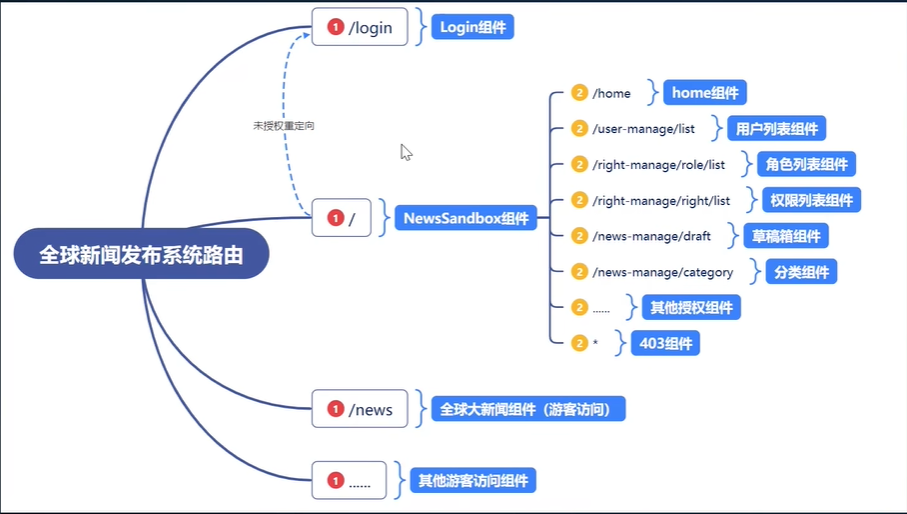
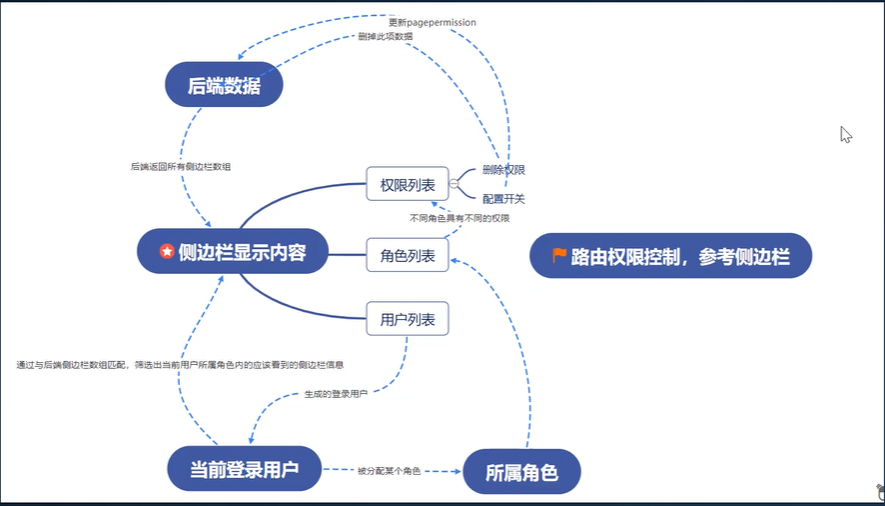

*目录*

- [NewsSystem](#NewsSystem)
  - [创建项目](#创建项目)
  - [路由](#路由)
  - [引入antd](#引入antd)
  - [JsonServer](#JsonServer)
  - [权限控制](#权限控制)
    - [权限列表](#权限列表)
    - [角色列表](#角色列表)
    - [用户列表](#用户列表)
    - [登录](#登录)
    - [路由权限](#路由权限)
  - [新闻业务](#新闻业务)
    - [新闻撰写](#新闻撰写)
    - [草稿箱列表](#草稿箱列表)
    - [审核管理](#审核管理)
    - [新闻分类](#新闻分类)
    - [发布管理](#发布管理)

# NewsSystem

  作者：zs

  版本：1.0.0

  版权：zs

## 创建项目

  ``` javascript
    // 创建项目
    npx create-react-app news_system
    
    // 引入sass
    npm i --save sass
    
    // 引入axios
    npm i --save axios
    
    // 安装模块配置请求代理解决跨域问题，在src文件夹下创建 setupProxy.js文件进行配置
    npm i --save http-proxy-middleware
    
  ```

## 路由

  
  
  ### 搭建路由

  ``` javascript
    // 直接安装是6，课程中使用的是5.2.0
    npm i --save react-router-dom@5.2.0
  ```

  - 创建 文件： src/route/index.js
  - import {HashRouter, Route} from "react-router-dom";

## 引入antd
  `antd` 是基于 Ant Design 设计体系的 React UI 组件库，主要用于研发企业级中后台产品。

### 安装antd
  
  ``` powershell
    npm install antd --save
  ```

  > 如果是antd5，不需要引入样式

### 基本布局

  *使用antd的Layout进行基本页面布局（导航栏、侧边栏、主体）*

## [JsonServer](https://www.npmjs.com/package/json-server)
  > 在不到30秒的时间内获得零编码的完全假冒REST API;用<3为需要快速后端进行原型设计和模拟的前端开发人员创建。

  - 安装json-server
    ``` powershell
      npm install -g json-server
    ```
  - 创建一个 `db.json` 文件
    ``` json
      {
        "posts": [
          { "id": 1, "title": "json-server", "author": "typicode" }
        ],
        "comments": [
          { "id": 1, "body": "some comment", "postId": 1 }
        ],
        "profile": { "name": "typicode" }
      }
    ```
  - 启动 json-server
    ``` js
      json-server --watch db.json --port 5000 // 启动 json-server 于5000端口
    ```
  - 访问 `http://localhost:3000/posts/1`
  - curd
    ``` javascript
      get     // 查
      post    // 增
      put     // 改
      patch   // 更新
      delete  // 删
      _embed  // 联合集合查询
      _expand // 向上查询（可返回子集的父级）
    ```
    
### 模拟后端服务

  - 封装axios方法
  - 接口统一管理
  - 动态渲染侧边栏

  *动态获取侧边栏后改变选中侧边栏，URL改变页面不刷新，经查阅是严格模式的问题*
    
  ``` javascript
    // index.js中的原写法
    <React.StrictMode>
      <App />
    </React.StrictMode>
    
    // 取消严格模式
    <App />
  ```

## 权限控制

  

### 权限列表

### 角色列表

### 用户列表
  > 升级 `antd` 至最新版本 `5.12.1`
  
  * 表格中筛选为 英文按钮 ，全局将 `antd` 英文转换为中文*
  ``` jsx
    import zhCN from 'antd/es/locale/zh_CN';
    import { ConfigProvider } from 'antd';
    
    <ConfigProvider locale={zhCN}>
      <App />
    </ConfigProvider>
  ```

### 登录

  - 使用 `react-particles-js` 实现粒子效果
    > `react-particles-js` 已停止维护，推荐使用 [`@tsparticles/react`](https://www.npmjs.com/package/@tsparticles/react)
    ``` powershell
      # 安装@tsparticles/react
      npm i @tsparticles/react
      
      # 安装@tsparticles/slim
      npm i @tsparticles/slim
    ```
  - 路由拦截 无 `token` 不能登录
    ```jsx
      {/* 重定向 */}
      <Route path="/" render={() => localStorage.getItem("token")
        ? <NewSandBox />
        : <Redirect to="/login"/>
      } />
    ```
  - 增加角色权限
    - 根据不同角色权限 展示不同的菜单
    - 根据不同角色权限 新增 用户权限 < 当前登录用户角色权限

### 路由权限
  - 动态路由（通过接口获取菜单，渲染）
  - 根据菜单开关状态、用户权限控制路由跳转
  - 安装 `nprogress` 实现加载条
    ``` powershell
      # 安装 nprogress
      npm install --save nprogress
      
      # 国外源下载较慢，不想使用 镜像，可通过配置npm代理解决
      npm config set proxy socks5://127.0.0.1:7890
    ``` 

## 新闻业务

### 新闻撰写

  - `PageHeader` 组件在 `antd 5` 已被废除 若要使用需安装 `@ant-design/pro-layout`
    ``` powershell
      # 安装@ant-design/pro-layout
      npm install --save @ant-design/pro-layout
    ```
  - [引入富文本编辑器进行撰写新闻](https://github.com/jpuri/react-draft-wysiwyg)
    ``` powershell
      # 安装 react-draft-wysiwyg draft-js
      npm install --save react-draft-wysiwyg draft-js
    ```
  - 封装富文本编辑组件

### 草稿箱列表
  - 删除功能
  - 预览功能
    - 创建预览路由 `/news-manage/preview/:id`
    - 存储时间戳，转换时间格式使用 `moment.js`
      ``` powershell
        # 安装 moment
        npm i --save moment
      ```
    - 实现预览富文本(dangerouslySetInnerHTML)
      ``` jsx
        <div dangerouslySetInnerHTML={{ __html: newsInfo?.content ?? "--" }} ></div>
      ```
  -  更新（修改）新闻信息功能
    - 可复用新增（撰写）新闻组件
    - 回显新闻信息
      - 回显富文本需要将 `html` 转换回 `draft` 对象，需要使用 `html-to-draftjs`
        ``` powershell
          # 安装 html-to-draftjs
          npm i --save html-to-draftjs 
        ```
        ``` js
          // 回显富文本
          useEffect(() => {
            if(!props.content) return;
            const contentBlock = htmlToDraft(props.content);
            if (contentBlock) {
              const contentState = ContentState.createFromBlockArray(contentBlock.contentBlocks);
              const editorState = EditorState.createWithContent(contentState);
              setEditorState(editorState)
            }
          }, [props.content]);
        ```
  - 提交审核功能


### 审核管理

  - 审核列表
    - 列表
    - 撤销功能
    - 编辑功能（复用）
    - 发布功能

  - 审核新闻
    - 列表（权限，不同角色看到的数据不同）
    - 审核功能（通过/驳回）

### 新闻分类

### 发布管理

  - 组件封装
    > 发布管理下的菜单：待发布、已发布、已下线 列表字段相同，将列表进行封装，减少冗余代码
  - 自定义Hooks
    > 将列表封装后，获取列表数据方法冗余，将其自定义Hooks
    - 在自定义hooks中实现发布、下线、删除操作

## 状态管理
  - 安装依赖
    ``` powershell
      # 安装 redux、react-redux
      npm i --save redux react-redux
    ```
  - 创建 `store`
    ``` js
      // import {createStore} from "redux";
      // createStore 已过时，替换为legacy_createStore
      import {legacy_createStore as createStore} from "redux";
      
      const store = createStore(() => {});
    ```
  - 实现侧边栏的折叠与展开
  - 实现loading的加载
    > 使用 `antd` 的加载组件 `<Spin size="large" />`，在发送请求前加载请求后取消加载
    - 直接再 `src/apis/request.js` 文件中请求之前 显示 loading 请求结束之后（finally） 隐藏 loading
    - 通过 `axios` 拦截器（interceptors）
      ```js
        // Add a request interceptor
        axios.interceptors.request.use(function (config) {
          // Do something before request is sent
          return config;
        }, function (error) {
          // Do something with request error
          return Promise.reject(error);
        });

        // Add a response interceptor
        axios.interceptors.response.use(function (response) {
          // Any status code that lie within the range of 2xx cause this function to trigger
          // Do something with response data
          return response;
        }, function (error) {
           // Any status codes that falls outside the range of 2xx cause this function to trigger
           // Do something with response error
           return Promise.reject(error);
        });
      ```
  - 数据持久化，使用 `Redux Persist` 进行数据持久化


## 首页
  - 首页数据展示
  - 使用 `echart` 实现 数据可视化（柱状图、饼状图）
