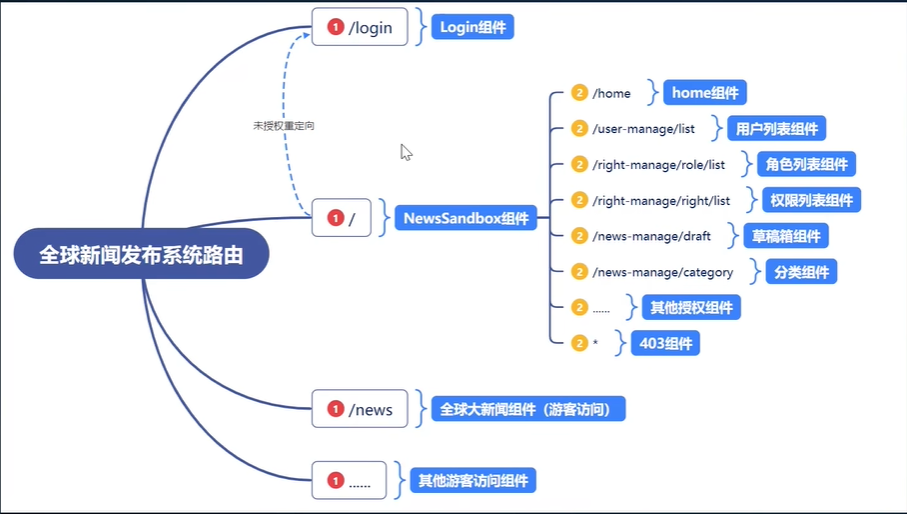

*目录*

- [NewsSystem](#NewsSystem)
  - [创建项目](#创建项目)
  - [路由](#路由)
  - [引入antd](#引入antd)
  - [](#)


# NewsSystem

  作者：zs

  版本：1.0.0

  版权：zs

## 创建项目

  ``` javascript
    // 创建项目
    npx create-react-app news_system
    
    // 引入sass
    npm i --save sass
    
    // 引入axios
    npm i --save axios
    
    // 安装模块配置请求代理解决跨域问题，在src文件夹下创建 setupProxy.js文件进行配置
    npm i --save http-proxy-middleware
    
  ```

## 路由

  
  
  ### 搭建路由

  ``` javascript
    // 直接安装是6，课程中使用的是5.2.0
    npm i --save react-router-dom@5.2.0
  ```

  - 创建 文件： src/route/index.js
  - import {HashRouter, Route} from "react-router-dom";

## 引入antd
  `antd` 是基于 Ant Design 设计体系的 React UI 组件库，主要用于研发企业级中后台产品。

### 安装antd
  
  ``` powershell
    npm install antd --save
  ```

  > 如果是antd5，不许要引入样式

### 基本布局

  *使用antd的Layout进行基本页面布局（导航栏、侧边栏、主体）*
